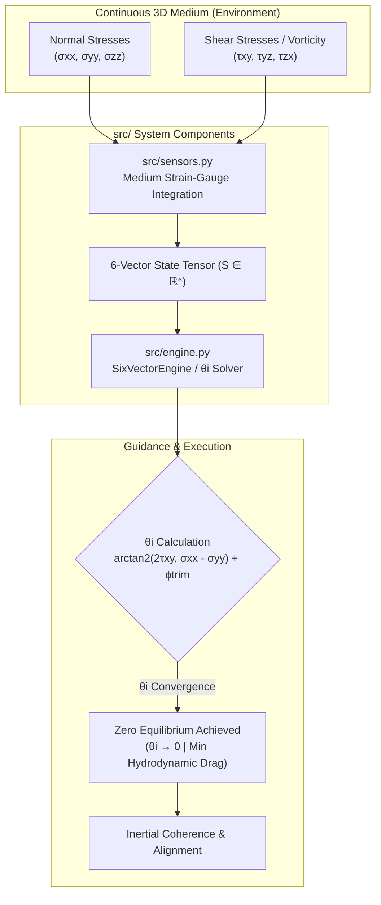
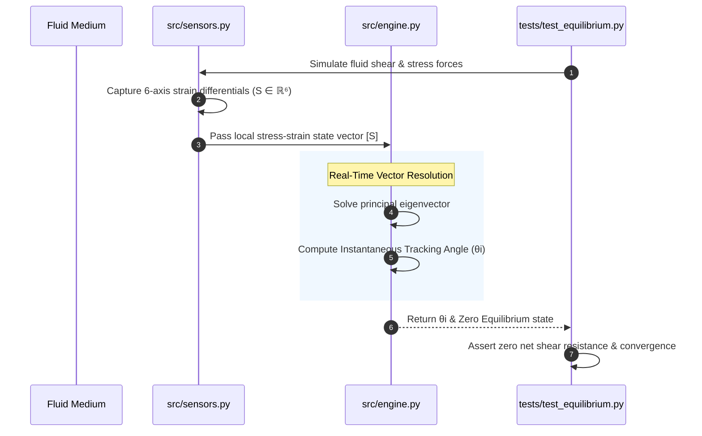

> **Framework Navigation:** 🌐 [Systems Ontology Overview](https://github.com/KevinBynum/systems-ontology-proof-of-concept) | 📐 [6-Vector Model (Resonance-Matrix)](https://github.com/KevinBynum/Resonance-Matrix)
---
# 6-Vector Autonomous Navigation Architecture

### Board Briefing & Technical Specification

**Classification:** Board Briefing & Technical Specification | **System Model:** 6-Vector Continuous Medium

---

## 1. Board Briefing: The Legacy Vacuum Bottleneck

Legacy Inertial Navigation Systems (INS) and fluid-tracking algorithms operate on an underlying **vacuum-narrative baseline**. When an autonomous vehicle encounters dynamic fluid forces (oceanic currents, atmospheric shear, pressure gradients), the guidance controller treats these environmental interactions as **external error vectors**. This assumption forces the system into continuous recalculation loops to correct for drift ($\Delta v$), resulting in computational lag, increased power consumption, and degraded positional fidelity.

The **6-Vector Ontological Framework** re-architects this baseline assumption. The physical vehicle is modeled not as an isolated point-mass moving through empty space, but as an immersed, structural extension of a **continuous 3D medium**. By calculating the instantaneous tracking angle ($\theta_i$) in real time against the medium's local stress-strain vectors, the 6-Vector engine maintains **Zero (Dynamic Equilibrium)** at the microsecond clock cycle—eliminating computational lag and turning ambient fluid motion into an alignment asset.

---

## 2. Architectural Comparison Matrix

| Operational Metric | Legacy Vacuum Paradigm (INS / GPS) | 6-Vector Continuous Medium Engine |
| :--- | :--- | :--- |
| **Baseline Assumption** | Body exists in isolated space; fluid environment is an external disturbance. | Body is an immersed, structural extension of the continuous 3D fluid medium. |
| **Vector Interpretation** | Environmental current = **Disruptive Error Vector** ($\Delta v$). | Environmental current = **Alignment & Energy-Transfer Vector**. |
| **Guidance Execution** | Recalculation loops correct for drift after displacement occurs (Reactive). | Instantaneous tracking angle ($\theta_i$) keeps system at **Zero (Dynamic Equilibrium)**. |
| **Computational Overhead** | Exponential scaling under turbulence due to recursive correction loops. | Constant $O(1)$ complexity via direct tensor geometric resolution. |
| **Sensor Reliance** | High dependence on external positioning reference signals (GPS/Acoustic Beacons). | High reliance on internal medium stress-strain differentials (GPS-denied operational capability). |

---

## 3. Mathematical Foundations: The 6-Vector Continuous Formulation

The 6-Vector engine resolves instantaneous position and body orientation by mapping the vehicle's state vector directly into a localized 6-axis orthogonal coordinate space embedded in the medium.

### 3.1 Local Stress-Strain Tensor Field
Let $\mathbf{S} \in \mathbb{R}^6$ represent the instantaneous 6-dimensional state of the surrounding continuous medium:

$$\mathbf{S} = \begin{bmatrix} \sigma_{xx} & \sigma_{yy} & \sigma_{zz} & \tau_{xy} & \tau_{yz} & \tau_{zx} \end{bmatrix}^T$$

Where:
* $\sigma_{xx}, \sigma_{yy}, \sigma_{zz}$ are normal stress components acting across the primary cardinal axes.
* $\tau_{xy}, \tau_{yz}, \tau_{zx}$ are shear stress components induced by fluid vorticity and rotational drift.

### 3.2 Instantaneous Tracking Angle ($\theta_i$)
To maintain **Zero Equilibrium**, the guidance engine solves for the scalar orientation angle $\theta_i$ that maximizes structural alignment along the principal eigenvector of the local stress tensor:

$$\theta_i = \arctan2 \left( \frac{2 \tau_{xy}}{\sigma_{xx} - \sigma_{yy}} \right) + \phi_{\text{trim}}$$

Where $\phi_{\text{trim}}$ is the structural trimming factor corresponding to hull geometry. When $\theta_i \to 0$, the vehicle experiences zero net shear resistance, achieving minimum hydrodynamic drag and continuous inertial coherence.

---
### System Data Flow Architecture

---

## 5. Deployment & Next Steps

1. **Review Core Solver:** Inspect `src/engine.py` to view the implementation of the $\theta_i$ tracking angle solver.
2. **Run Validation Suite:** Verify dynamic equilibrium convergence under simulated fluid shear conditions.
### Engine Execution Sequence

